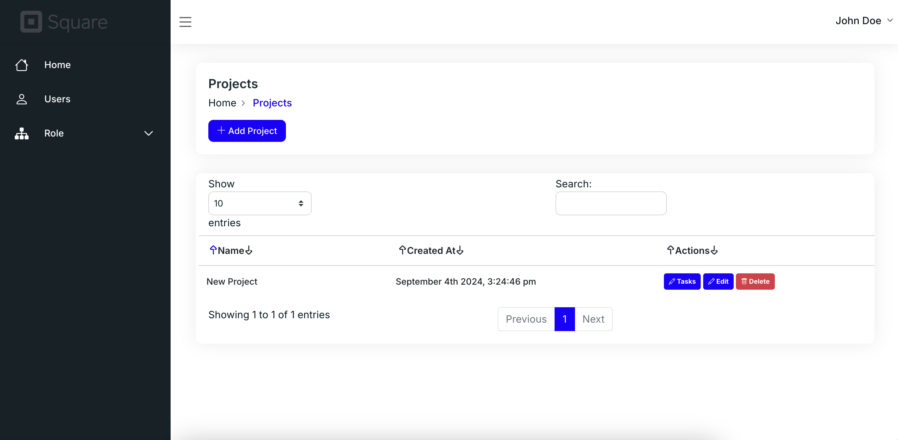

## About Laravel Trials

This project created for Task, Project and User Management.

This project contains:

- User Authentication
- Role And Permission
- Dockerization
- Repository Pattern
- Unit Testing
- Real Time Task Notification with Redis and Socket
- Advanced Search

All of CRUD's in admin panel has been processing with JS and Ajax.

## To start the project, you have to execute following commands,

composer install 
npm install

## To Run project on Docker;

sail up -d

## If sail up not works
./vendor/bin/sail up -d

## Or you can define alias such like
alias sail='sh $([ -f sail ] && echo sail || echo vendor/bin/sail)'

## After project starts run following commands;
sail artisan migrate 
sail artisan db:seed

## Then, start the laravel echo  
laravel-echo-server start

### <strong style="color:red;">Note:</strong> Redis password is not defined as default, if you want to use, you can set it. 

## After doing all of things, visit localhost and type;
email = johndoe@example.com 
password = password

#### You are all set now. Can add projects, tasks and users. And also can edit them. Open specific project like /dashboard/tasks/{id} and on another page, add new task, you will hear "beep" voice and new data will be set to datatable.

## For Unit Tests Run;

sail artisan test

